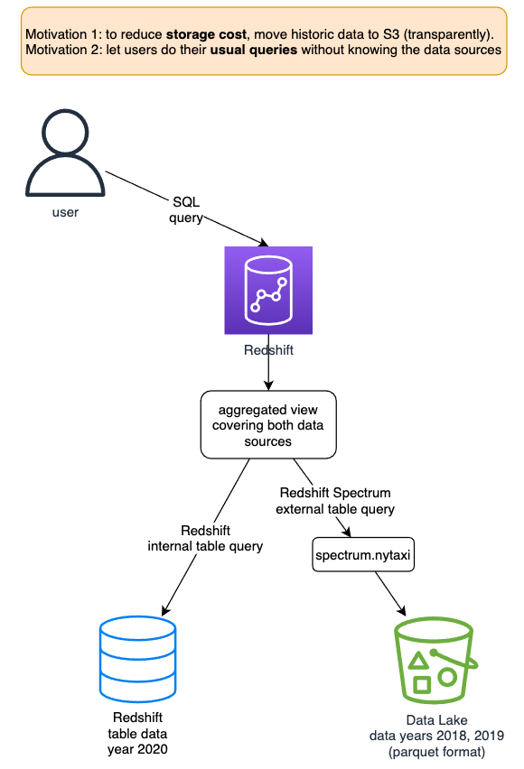
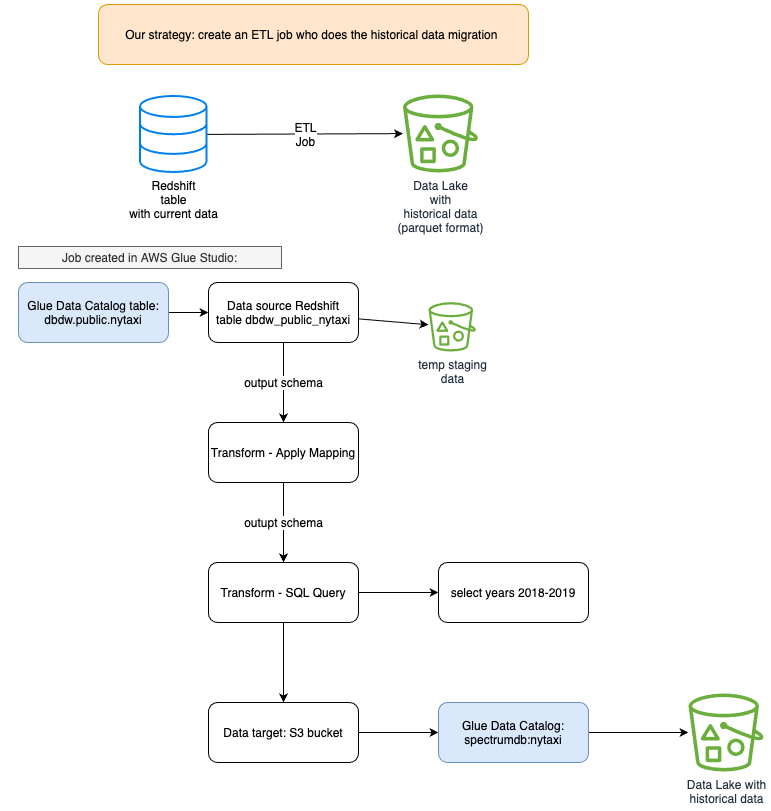

# AWS Glue Studio Demo

An [**Amazon Redshift**](https://aws.amazon.com/redshift/) cluster can hold petabytes of data internally. However, if you need to hold historical data in the order of exabytes, you will need to export the oldest part of your data to a [*Data Lake*, built on top of **S3**](https://aws.amazon.com/big-data/datalakes-and-analytics/datalakes/).

After unloading this oldest data to the *Data Lake* and removing it from the *Data Warehouse*, you can execute queries joining data from both **Redshift** and **S3**, using [**Redshift Spectrum**](https://docs.aws.amazon.com/redshift/latest/dg/c-using-spectrum.html) to achieve this goal.

In this *DEMO*, we'll move historic data from **Redshift** to **S3** and create an aggregated *VIEW* covering both data sources. It uses a publicly available New York Green taxi rides dataset from years **2018**, **2019**, and **2020**, originally supplied in *CSV* format, which was loaded to a **Redshift** cluster. This dataset is available in the [NYC Taxi & Limousine Commission trip record data](https://www1.nyc.gov/site/tlc/about/tlc-trip-record-data.page) site.

The main motivations for this approach are the following:   
- Reduce storage cost, moving historic data to **S3** (transparently), and releasing storage space on **Redshift** cluster.
- Let users do their usual queries without knowing the data sources.

For this data movement, you will learn how to do that with an [**AWS Glue**](https://aws.amazon.com/glue/) *ETL* job, which will be created visually using [**AWS Glue Studio**](https://docs.aws.amazon.com/glue/latest/ug/what-is-glue-studio.html).

This is the *DEMO* presented at **AWS re:Invent 2021**.

Now, it's available to anyone who would like to try it!

## Table of Contents

- [Pre-requirements](/contents/pre-requirements.md)
- [Demo workflow](/contents/demo-workflow.md)
  - [Part 01 - Analyzing data on Redshift](/contents/demo-workflow.md#part-01---analyzing-data-on-redshift)
  - [Part 02 - Create a Glue ETL job with AWS Glue Studio](/contents/demo-workflow.md#part-02---create-a-glue-etl-job-with-aws-glue-studio)
  - [Part 03 - Query both Data Warehouse (Redshift) and Data Lake (S3) with Redshift Spectrum](/contents/demo-workflow.md#part-03---query-both-data-warehouse-redshift-and-data-lake-s3-with-redshift-spectrum)
- [Cleaning up](/contents/cleaning-up.md)
